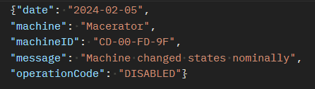
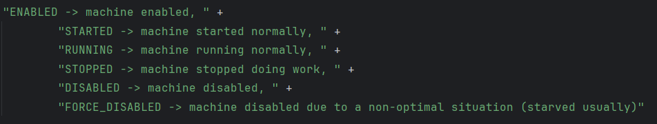

# horizons-kotlin

This project uses Quarkus, very cool web framework for java and kotlin.
The horizons-kotlin project was built to store and then persist log data to a gui client.
It uses a postgres database running in a container, a Rest api to post and get logs, and 
a websocket connection to actively persist logs to a website.
### Using the application
- The application is all local, so you wont be seeing any logs from my server pop up on your web interface at 
http://localhost:8080. From there you can click the button to connect, at that point it will display any logs added
to the database.
- To add a log post json to http://localhost:8080/logs in this format:

 I use postman for websocket and Rest calls
- The date must be in (YYYY-MM-DD) format, if you dont have it in the correct format, a date object will be returned 
signaling to you to change the date.
- Machine, machineID, Message and OperationCode can be any text. 
- OperationCode does have recommended strings, which will be returned if data is invalid.
Codes:


### Application dependencies
- You will need a container engine on your computer, and it must be able to accessible through a docker api.
I use podman which has a compatible api for quarkus. 
- The first time you launch this app it could take a while as a postgres image will need to be pulled if you dont
already have one
- Java 17
- git

### Cloning the project
- When in a directory where you want a project folder, clone the repo by typing:
```shell script
git clone https://github.com/cwdatlas/GregLogger-Kotlin
```
- Then navigate into the repo:
```shell script
cd GregLogger-Kotlin
```
- Now you can proceed to run the application how you like. This application will take
some time to build for the first time, especially if you have not pulled a postgres image in your container engine.
Quarkus will pull a postgres container if one does not exist.
## Running the application in dev mode

You can run the application in dev mode that enables live coding using:
```shell script
./gradlew quarkusDev
```

> **_NOTE:_**  Quarkus now ships with a Dev UI, which is available in dev mode only at http://localhost:8080/q/dev/.
<= this is super cool
## Packaging and running the application

The application can be packaged using:
```shell script
./gradlew build
```
It produces the `quarkus-run.jar` file in the `build/quarkus-app/` directory.
Be aware that it’s not an _über-jar_ as the dependencies are copied into the `build/quarkus-app/lib/` directory.

The application is now runnable using `java -jar build/quarkus-app/quarkus-run.jar`.

If you want to build an _über-jar_, execute the following command:
```shell script
./gradlew build -Dquarkus.package.type=uber-jar
```

The application, packaged as an _über-jar_, is now runnable using `java -jar build/*-runner.jar`.

## Creating a native executable

You can create a native executable using: 
```shell script
./gradlew build -Dquarkus.package.type=native
```

Or, if you don't have GraalVM installed, you can run the native executable build in a container using: 
```shell script
./gradlew build -Dquarkus.package.type=native -Dquarkus.native.container-build=true
```

You can then execute your native executable with: `./build/horizons-kotlin-1.0.0-SNAPSHOT-runner`

If you want to learn more about building native executables, please consult https://quarkus.io/guides/gradle-tooling.

### Thanks
Thank you for checking out this project. I was new to many of its parts so it didn't end up exactly how i wanted.
I did learn lots doing it. By the way, the nice format of this file came with Quarkus, I just added onto it!


